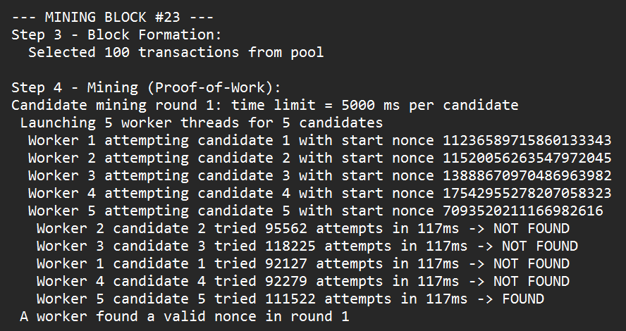

# Povilo Jurgulio Blokų Grandinių Technologijų 2 laboratorinis darbas (v0.2)

Trumpas aprašymas


Šis laboratorinis darbas yra supaprastintos blokų grandinės realizacija. Naudojau C++ kalbą. ChatGPT padėjo sugalvoti struktūrą ir ko reikia programoje; pats žiūrėjau labai daug Youtube video ir bandžiau suprasti kaip veikia Bitcoin ir tiesiog blockchain, ir tai man padėjo pačiam kažkiek realizuoti funkcijų, bet dažnai, kai darydavau funkcijas ar metodus, reikėdavo paklausti chatgpt, kad patvarkytų, nes nebūdavo pilnai gerai, kai pats dariau. Labiausiai AI padėjo su lygiagretaus kasimo realizacija. Dar normaliai idėjų gavau tyrinėdamas Google.
Naudojau savo hash_function iš praeito laboratorinio darbo ir nieko nekeičiau.

Šis kodas generuoja vartotojus ir transakcijas, formuoja blokus, atlieka Proof-of-Work (PoW), atnaujina vartotojų balansus, naudoja lygiagretų kasimo procesą (minePendingTransactions() metode). Deja, nesugebėjau realizuoti UTXO modelio, nes pritrūko laiko ir nelabai žinojau kaip daryti (būtų reikėję labai daug AI pagalbos).

## Eigos santrauka
1. Generuojamas vartotojų sąrašas su atsitiktiniais balansais.
2. Sukuriamas mempool (transakcijų rinkinys).
3. `Blockchain::minePendingTransactions(...)`:
	 - Pasirenka iki `max_txs_per_block` galiojančių transakcijų (simuliuojant balansus arba tikrinant transakcijų ID).
	 - Prideda reward/coinbase transakciją kasėjui (miner'iui).
	 - Sukuriamas blokas su atrinktų transakcijų sąrašu ir apskaičiuojamas Merkle root.
	 - Bandoma rasti galiojantį nonce: generuojami keli kandidatų (seeds) ir paleidžiami worker thread'ai, kurių kiekvienas bando rasti nonce per ribotą laiką; jeigu per kelis retry round'us niekas neranda, vyksta pilnas (nesibaigiantis) mining.
	 - Sėkmingas blokas pridedamas į grandinę, įrašomi pakeitimai į vartotojų balansus ir mempool atnaujinamas (pašalinamos įtrauktos transakcijos).

## Svarbiausios vietos kode
- `main.cpp` — programos startas: generuoja vartotojus, transakcijas ir kviečia `minePendingTransactions` cikliškai, kol mempool tuščias.
- `all_classes.h` / `all_classes.cpp` — sudėtinės klasių deklaracijos ir įgyvendinimai: `Transaction`, `User`, `UserGenerator`, `TransactionGenerator`, `MerkleTree`.
- `Block.h` / `Block.cpp` — bloko struktūra, header string ir hashing, Merkle root skaičiavimas, `mineBlock()` ir `tryMineForDuration()`.
- `Blockchain.h` / `Blockchain.cpp` — grandinės valdymas: mempool, transakcijų atranka (simulated balances), kandidatų pagrindu parallel mining, blokų pritaikymas (apply) ir validacija (`isChainValid`).
- `hash_function.cpp` — maišos funkcija, naudojama transakcijų ID ir bloko hasho generavimui (jos nekeičiau).

## Ką spausdina header preview
- Prev Hash (ankstesnio bloko hash, sutrumpintas)
- Version
- Timestamp (UTC)
- Merkle Root (sutrumpintas)
- Difficulty Target
- Found Nonce / Block Hash (kai radimas sėkmingas)

## Trumpas pseudokodas (svarbiausio algoritmo)

Bloko formavimas ir mining (supaprastintas pseudokodas):

```
function minePendingTransactions(minerAddress, users, maxTxs):
	prevMempool = pending_transactions.size
	selected = []
	simBalances = copy(users.balances)

	for tx in pending_transactions:
		if selected.size >= maxTxs: break
		if recomputeHash(tx.toString()) != tx.id: continue
		if tx.from == SYSTEM:
			selected.push(tx); simBalances[tx.to] += tx.amount; continue
		if simBalances[tx.from] >= tx.amount:
			simBalances[tx.from] -= tx.amount
			simBalances[tx.to] += tx.amount
			selected.push(tx)

	// add reward
	selected.push(Transaction(SYSTEM, minerAddress, reward))

	newBlock = Block(prevHash, selected, difficulty)

	// candidate-based, multithreaded mining
	for round in 1..MAX_ROUNDS:
		seeds = generate_random_seeds(CANDIDATES)
		workers = min(CANDIDATES, hw_threads)
		nextIdx = atomic(0); stopFlag = atomic(false)

		spawn workers: each worker:
			while not stopFlag:
				idx = nextIdx.fetch_add(1)
				if idx >= CANDIDATES: break
				cand = copy(newBlock); cand.setNonce(seeds[idx])
				ok = cand.tryMineForDuration(timeLimitMs, ... , &stopFlag)
				if ok: winner=cand; stopFlag=true; break

		join workers
		if stopFlag: newBlock = winner; break
		timeLimitMs *= 2 // retry with longer per-candidate time

	if not found: newBlock.mineBlock() // fallback

	chain.push_back(newBlock)

	// apply transactions to users (account model)
	for tx in selected:
		if tx.from != SYSTEM: users[tx.from] -= tx.amount
		users[tx.to] += tx.amount

	remove included tx from pending_transactions
```

## Mining:
 "Mining" gali užtrukti priklausomai nuo nustatyto sunkumo (difficulty). Testams galite laikinai sumažinti sunkumą ar sumažinti transakcijų skaičių greitam paleidimui.

 Kai difficulty yra ant 6 (000000), tai programa pradeda užtrukti labai ilgai, bet, jeigu yra ant 3-5, tai bus greitas paleidimas ir beveik visada blokai bus "mined" per pirmą bandymą (taip nebus su difficulty=6).

 Mining pavyzdys (čia "Worker" yra tiesiog thread):
 
 
## Pilnos programos pseudokodas (labai supaprastintas)

```
// Program entry
function main():
	users = UserGenerator.generateUsers(N_USERS)
	txs = TransactionGenerator.generateTransactions(users, TOTAL_TXS)
	blockchain = Blockchain(difficulty, mining_reward)

	for tx in txs: blockchain.addTransaction(tx)

	// Mine until mempool empty
	while blockchain.getPendingTransactions().size() > 0:
		minerAddr = chooseMinerAddress()
		blockchain.minePendingTransactions(minerAddr, users, MAX_TXS_PER_BLOCK)

	// Final checks
	if not blockchain.isChainValid():
		print("Chain invalid")
	else:
		blockchain.displayChain()


// Blockchain::minePendingTransactions (end-to-end)
function minePendingTransactions(minerAddress, users, maxTxs):
	// 1) Select valid transactions (simulate balances)
	selected = selectValidTxs(pending_transactions, users, maxTxs)

	// 2) Add coinbase/reward tx
	selected.append(Transaction(SYSTEM, minerAddress, mining_reward))

	// 3) Build block
	block = Block(prevHash=getLatestBlock().getBlockHash(), transactions=selected, difficulty)
	compute block.merkle_root

	// 4) Candidate-based multi-threaded mining
	found = false
	timeLimit = INITIAL_TIME_LIMIT_MS
	for round = 1 to MAX_ROUNDS and not found:
		seeds = randomSeeds(CANDIDATES)
		workers = min(CANDIDATES, hardware_concurrency())
		nextIdx = atomic(0); stopFlag = atomic(false)

		// spawn worker threads
		spawn workers threads:
			while true:
				idx = nextIdx.fetch_add(1)
				if idx >= CANDIDATES or stopFlag: break
				candidate = copy(block); candidate.setNonce(seeds[idx])
				ok = candidate.tryMineForDuration(timeLimit, MAX_ATTEMPTS, attemptsOut, elapsedOut, &stopFlag)
				if ok: winner = candidate; stopFlag = true; break

		join all workers
		if stopFlag: block = winner; found = true; break
		timeLimit *= 2 // retry with longer per-candidate time

	// 5) Fallback to full mining if none found
	if not found: block.mineBlock()

	// 6) Commit block
	chain.push_back(block)
	applySelectedTransactionsToUsers(selected, users)
	removeSelectedFromMempool(selected)


// tryMineForDuration (worker mining loop)
function tryMineForDuration(timeLimitMs, maxAttempts, &attemptsOut, &elapsedOut, &stopFlag):
	start = now()
	attempts = 0
	while attempts < maxAttempts and not stopFlag:
		hash = computeHash(block.getHeaderString())
		if hash startsWith N zeroes (difficulty):
			block.block_hash = hash; block.is_mined = true
			if stopFlag: stopFlag = true
			elapsedOut = now() - start; attemptsOut = attempts; return true
		nonce++; attempts++
		if now() - start >= timeLimitMs: break
	elapsedOut = now() - start; attemptsOut = attempts; return false


// Helpers used above
function selectValidTxs(mempool, users, maxTxs):
	simBalances = copy(users.balances)
	selected = []
	for tx in mempool:
		if selected.size >= maxTxs: break
		if recomputeHash(tx.toString()) != tx.id: continue
		if tx.from == SYSTEM: selected.push(tx); simBalances[tx.to] += tx.amount; continue
		if simBalances[tx.from] >= tx.amount:
			simBalances[tx.from] -= tx.amount; simBalances[tx.to] += tx.amount; selected.push(tx)
	return selected

function applySelectedTransactionsToUsers(selected, users):
	for tx in selected:
		if tx.from != SYSTEM: users.find(tx.from).subtractFromBalance(tx.amount)
		users.find(tx.to).addToBalance(tx.amount)

function removeSelectedFromMempool(selected):
	for tx in selected: pending_transactions.erase(tx.id)

```